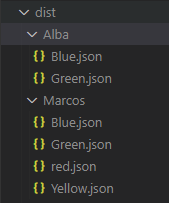
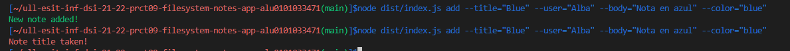
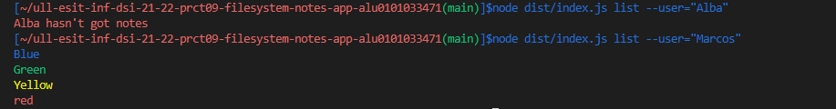
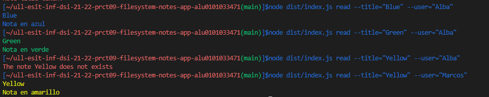
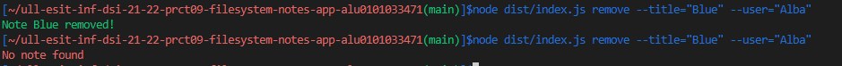
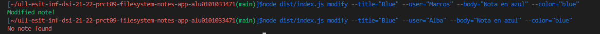
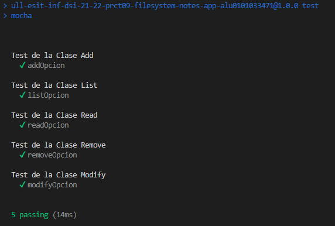
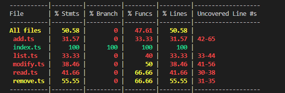

# Informe de la actividad
Práctica sobre una aplicación de procesamientos de notas de texto. Donde se permite añadir, modificar, eliminar, listar y leer notas de un usuario concreto. Además,  las notas se almacenarán como ficheros JSON

## Desarrollo
Para el desarrollo de esta práctica se ha contado con 5 clases en 5 ficheros (una clase por cada procesamiento de nota) y un **index.ts**, que será nuestro fichero principal.

## Estructura
Para el siguiente ejercicio se preparó:
* La clase  **Add** con un método que implementa la herramienta **yargs** para poder añadir notas de texto y crear los directorios donde se van a almacenar segundo el usuario que ejecute el comando.
* La clase  **List** con un método que implementa la herramienta **yargs** para poder listar las notas de texto de un usuario.
* La clase  **Read** con un método que implementa la herramienta **yargs** para poder leer una nota en concreto de un usuario.
* La clase  **Remove** con un método que implementa la herramienta **yargs** para poder eliminar una nota en concreto de un usuario.
* La clase  **Modify** con un método que implementa la herramienta **yargs** para poder modificar una nota en concreto de un usuario.

En cuanto a las notas de texto, contienen una estructura de tipo **json** en el cual interesa almacenar un título, un cuerpo y un color para cada nota:
```JSON
{
  "title": ,
  "body": ,
  "color": 
}
```
Las notas, como se pedía en uno de los puntos, han sido almacenadas en directorios con el nombre del usuario que invocaba el comando dentro del directorio **dist**.



## Código
### Clase Add

La clase **Add** cuenta con un método **addNote()** que se encarga de usar la herramienta **yargs** con el comando **add** que se pasaría por linea de comandos. En este caso se necesita para construirse:
* Un **title** con el título de la nota a añadir.
* Un **user** con el nombre del usuario que invoca el comando.
* Un **body** con el texto que se quiere incluir en la nota.
* Un **color** con el nombre del color en el cual se quiere visualizar el texto de la nota  con la herramienta **chalk**.
Para que el comando **add** funcione correctamente es obligatorio el uso de estos parametros.
```typescript
yargs.command({
      command: 'add',
      describe: 'Add a new note',
      builder: {
        title: {
          describe: 'Note title',
          demandOption: true,
          type: 'string',
        },
        user: {
          describe: 'Name user',
          demandOption: true,
          type: 'string',
        },
        body: {
          describe: 'Body of the note',
          demandOption: true,
          type: 'string',
        },
        color: {
          describe: 'Color of the letters',
          demandOption: true,
          type: 'string',
        }
      }
```

Posteriormente, en el manejador **handler** de dicho comando que recibe como parámetro un objeto **argv** que contiene los pares opción-valor del comando, el método comienza comprobando si existe dentro de la carpeta **dist** un directorio con el nombre del **user** que invocó el comando. EN caso negativo, se creará dicho directorio.
```typescript
      handler(argv) {
        if (!fs.existsSync(`./dist/${String(argv.user)}`)){
          fs.mkdir(path.join(__dirname, String(argv.user)), (err) => {
            if (err) {
              return console.error(chalk.red(err));
            }
          });
        }
```

Después, se comprueba si existe una nota dentro del directorio del usuario con el mismo nombre que el título de la nueva nota que se quiere añadir, en caso afirmativo se notifica con un mensaje de error en color rojo con la herramienta **chalk** donde se informa de que esa nota ya existe. En caso negativo, se crea una variable **info** con el formato que se quiere almacenar una nota, introduciendo los valores **tittle**, **body** y **color** y pasando la estructura de dicha variable a formato **JSON** para seguidamente crear dicha nota en el directorio del usuario.
```typescript
        if (fs.existsSync(`./dist/${argv.user}/${argv.title}.json`)){
          console.error(chalk.red('Note title taken!'));
        }
        else{
          let info = {
            title: String(argv.title),
            body: String(argv.body),
            color: argv.color
          };
          let data = JSON.stringify(info, null, 2);
          setTimeout(() => {
            fs.writeFile(`./dist/${argv.user}/${argv.title}.json`, data, (err) => {
              if (err) {
                return console.error(chalk.red(err));
              }
              else{
                console.log(chalk.green(`New note added!`));
              }
            });
          }, 1000);
        }
```

### Clase List

La clase **List** cuenta con un método **listNote()** que se encarga de usar la herramienta **yargs** con el comando **list** que se pasaría por linea de comandos. En este caso se necesita para construirse:
* Un **user** con el nombre del usuario que invoca el comando.
```typescript
listNote(){
    yargs.command({
      command: 'list',
      describe: 'List the notes of the user',
      builder: {
        user: {
          describe: 'Name user',
          demandOption: true,
          type: 'string',
        }
      },
```
Posteriormente, en el manejador **handler**, el método comienza leyendo el directorio de dicho usuario, si no existe dicho directorio se notifica con mensaje de error. En caso de que el directorio si existe, se realiza un bucle **forEach** sobre el directorio, en el cual, se usa una variable **jsonData** con la estructura **json** de la nota seleccionada y se muestra por consola el titulo de la nota en el color que se alamacenó a la hora de crearse. Para el caso de que el directorio no tuviese ningun archivo, se creó un contador que no aumenta si no entra en el bucle **forEach** y que nos ayuda a notificar de la ausencia de archivos en el directorio.
```typescript
    handler(argv) {
        fs.readdir(`./dist/${String(argv.user)}`, (err, files) =>  {
          if(err){
            console.error(chalk.red(`${argv.user} does not exists`));
          } else {
            let i:number = 0;
            files.forEach(file => {
              let jsonData = require(`./${String(argv.user)}/${String(file)}`);
              console.log(chalk[`${jsonData.color}`](String(jsonData.title)));
              i++;
            });
            if(i === 0){
              console.error(chalk.red(`${argv.user} hasn't got notes`));
            }
          }
        });
      },
    });
```

### Clase Remove

La clase **Remove** cuenta con un método **removeNote()** que se encarga de usar la herramienta **yargs** con el comando **remove** que se pasaría por linea de comandos. En este caso se necesita para construirse:
* Un **title** con el título de la nota a borrar.
* Un **user** con el nombre del usuario que invoca el comando.
```typescript
  removeNote(){
    yargs.command({
      command: 'remove',
      describe: 'Remove the notes of the user',
      builder: {
        title: {
          describe: 'Note title',
          demandOption: true,
          type: 'string',
        },
        user: {
          describe: 'Name user',
          demandOption: true,
          type: 'string',
        }
      },
```

Posteriormente, en el manejador **handler**, el método comienza comprobando si existe una nota con ese **tittle** en el directorio del usuario. En caso negativo se notifica de un error, y en caso positivo se elimina dicha nota y se notifica por pantalla.
```typescript
      handler(argv) {
        if (!fs.existsSync(`./dist/${String(argv.user)}/${String(argv.title)}.json`)){
          console.error(chalk.red(`No note found`));
        } else {
          fs.unlinkSync(`./dist/${String(argv.user)}/${String(argv.title)}.json`);
          console.log(chalk.green(`Note ${String(argv.title)} removed!`));
        }  
      },
```

### Clase Read

La clase **Read** cuenta con un método **readNote()** que se encarga de usar la herramienta **yargs** con el comando **read** que se pasaría por linea de comandos. En este caso se necesita para construirse:
* Un **title** con el título de la nota a añadir.
* Un **user** con el nombre del usuario que invoca el comando.
```typescript
  readNote(){
    yargs.command({
      command: 'read',
      describe: 'Read the notes of the user',
      builder: {
        user: {
          describe: 'Name user',
          demandOption: true,
          type: 'string',
        },title: {
          describe: 'Note title',
          demandOption: true,
          type: 'string',
        }
      },
```

Posteriormente, en el manejador **handler**, el método comienza comprobando si existe un directorio con el nombre de dicho usuario para notificar de su no existencia. Después, se comprueba si existe una nota dentro del directorio con el nombre del **tittle** que se ha pasado por comando. En caso de que exista dicha nota, se usa la variable **jsonData** para almacenar la información de dicha nota en formato **json** y mostrar por consola el **tittle** y el **body** de la nota en el color correspondiente.
```typescript
    handler(argv) {
        if (!fs.existsSync(`./dist/${String(argv.user)}`)){
          console.error(chalk.red(`${argv.user} does not exists`));
        }
        if (!fs.existsSync(`./dist/${String(argv.user)}/${String(argv.title)}.json`)){
          console.error(chalk.red(`The note ${String(argv.title)} does not exists`));
        } else {
          let jsonData = require(`./${String(argv.user)}/${String(argv.title)}.json`);
          console.log(chalk[`${jsonData.color}`](jsonData.title));
          console.log(chalk[`${jsonData.color}`](jsonData.body));
        }
      },
    });
```

### Clase Modify

La clase **Modify** cuenta con un método **modifyNote()** que se encarga de usar la herramienta **yargs** con el comando **modify** que se pasaría por linea de comandos. En este caso se necesita para construirse:
* Un **title** con el título de la nota a modificar.
* Un **user** con el nombre del usuario que invoca el comando.
* Un **body** con el texto que se quiere incluir en la nota.
* Un **color** con el nombre del color en el cual se quiere visualizar el texto de la nota  con la herramienta **chalk**.
Para que el comando **modify** funcione correctamente es obligatorio el uso de todos estos parametros.
```typescript
  modifyNote(){
    yargs.command({
      command: 'modify',
      describe: 'modify a note',
      builder: {
        title: {
          describe: 'Note title',
          demandOption: true,
          type: 'string',
        },
        user: {
          describe: 'Name user',
          demandOption: true,
          type: 'string',
        },
        body: {
          describe: 'Body of the note',
          demandOption: true,
          type: 'string',
        },
        color: {
          describe: 'Color of the letters',
          demandOption: true,
          type: 'string',
        }
      },
```

Posteriormente, en el manejador **handler**, el método comienza buscando la nota en el directorio del usuario con el **tittle** pasado por comando. En caso de encontrar la nota se crea una variable **info** con el formato que se quiere almacenar la nota, introduciendo los valores **tittle**, **body** y **color** y pasando la estructura de dicha variable a formato **JSON** para seguidamente modificar dicha nota en el directorio del usuario.
```typescript
      handler(argv) {
        if (!fs.existsSync(`./dist/${String(argv.user)}/${String(argv.title)}.json`)){
          console.error(chalk.red(`No note found`));
        }
        else{
          let info = {
            title: String(argv.title),
            body: String(argv.body),
            color: argv.color
          };
          let data = JSON.stringify(info, null, 2);
            fs.writeFile(`./dist/${argv.user}/${argv.title}.json`, data, (err) => {
              if (err) {
                return console.error(chalk.red(err));
              }
              else{
                console.log(chalk.green(`Modified note!`));
              }
            });
          }
        },
```

### index.ts

En el **index.ts** se crea una constante de cada clase y se ejecuta el método de cada clase, terminando con la sentencia ```yargs.parse()``` para poder procesar los argumentos pasados desde línea de comandos a la aplicación.

## Resultados

### Comandos add



### Comandos list



### Comandos read



### Comandos remove



### Comandos modify



## Test Unitario
En cuanto a los test, al haber realizado una estructura tan simple sin una clase **Note** que contenga un diseño de nota, se ha complicado la realización de pruebas de código
```typescript
describe('Test de la Clase Add',() => {
  it ('addOpcion',() => { 
    expect(addOpcion instanceof Add).to.eql (true);
    expect(addOpcion.addNote()).not.to.equal (null);
  });
});
describe('Test de la Clase List',() => {
  it ('listOpcion',() => { 
    expect(listOpcion instanceof List).to.eql (true);
    expect(listOpcion.listNote()).not.to.equal (null);
  });
});
describe('Test de la Clase Read',() => {
  it ('readOpcion',() => { 
    expect(readOpcion instanceof Read).to.eql (true);
    expect(readOpcion.readNote()).not.to.equal (null);
  });
});
describe('Test de la Clase Remove',() => {
  it ('removeOpcion',() => { 
    expect(removeOpcion instanceof Remove).to.eql (true);
    expect(removeOpcion.removeNote()).not.to.equal (null);
  });
});
describe('Test de la Clase Modify',() => {
  it ('modifyOpcion',() => { 
    expect(modifyOpcion instanceof Modify).to.eql (true);
    expect(modifyOpcion.modifyNote()).not.to.equal (null);
  });
});
``` 


## Coverage
Por el mismo motivo que los test, el coverage realizado ha quedado muy pobre.



## Conclusion

En esta actividad se ha comenzado a trabajar con paquetes como **chalk** y **yargs** que han brindado de gran ayuda para el uso de Node.js para trabajar con el sistema de ficheros.
Como dato a mejorar, la realización de test unitarios. Los test unitarios no son un punto fuerte del alumno que realiza este proyecto, necesitando estructurar los proyectos de mejor manera para dichos test.